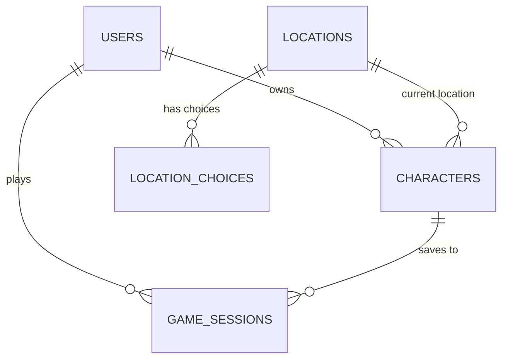

# Miserere Mei - Technical Architecture Documentation

## Table of Contents

- [System Overview](#system-overview)
- [Architecture Patterns](#architecture-patterns)
- [Technology Stack](#technology-stack)
- [System Components](#system-components)
- [Data Architecture](#data-architecture)
- [API Design](#api-design)
- [Security Architecture](#security-architecture)
- [Deployment Architecture](#deployment-architecture)
- [Monitoring and Observability](#monitoring-and-observability)
- [Performance Considerations](#performance-considerations)

## System Overview

Miserere Mei is a modern web-based text adventure game built with a
microservices architecture, featuring a decoupled frontend and backend system.
The application is designed for scalability, maintainability, and security.

### High-Level Architecture

```
┌─────────────────┐    ┌─────────────────┐    ┌─────────────────┐
│   Web Browser   │    │   Load Balancer │    │   CDN/Cache     │
└─────────────────┘    └─────────────────┘    └─────────────────┘
         │                       │                       │
         └───────────────────────┼───────────────────────┘
                                 │
    ┌─────────────────────────────────────────────────────────┐
    │                Frontend Layer                           │
    │  ┌─────────────────┐  ┌─────────────────┐             │
    │  │  Angular SPA    │  │  Nginx Proxy    │             │
    │  │  (TypeScript)   │  │  (Static Files) │             │
    │  └─────────────────┘  └─────────────────┘             │
    └─────────────────────────────────────────────────────────┘
                                 │
    ┌─────────────────────────────────────────────────────────┐
    │                 API Gateway                             │
    │  ┌─────────────────┐  ┌─────────────────┐             │
    │  │ Rate Limiting   │  │ Authentication  │             │
    │  │ Load Balancing  │  │ Authorization   │             │
    │  └─────────────────┘  └─────────────────┘             │
    └─────────────────────────────────────────────────────────┘
                                 │
    ┌─────────────────────────────────────────────────────────┐
    │                Backend Layer                            │
    │  ┌─────────────────┐  ┌─────────────────┐             │
    │  │  Express.js API │  │   Business      │             │
    │  │  (Node.js)      │  │   Logic Layer   │             │
    │  └─────────────────┘  └─────────────────┘             │
    └─────────────────────────────────────────────────────────┘
                                 │
    ┌─────────────────────────────────────────────────────────┐
    │               Data Layer                                │
    │  ┌─────────────────┐  ┌─────────────────┐             │
    │  │   MySQL DB      │  │   Redis Cache   │             │
    │  │  (Persistent)   │  │   (Session)     │             │
    │  └─────────────────┘  └─────────────────┘             │
    └─────────────────────────────────────────────────────────┘
```

## Architecture Patterns

### 1. **Layered Architecture**

- **Presentation Layer**: Angular frontend with reactive programming
- **API Layer**: RESTful services with Express.js
- **Business Logic Layer**: Game engine and rules processing
- **Data Access Layer**: Sequelize ORM with MySQL

### 2. **Model-View-Controller (MVC)**

- **Models**: Sequelize models for game entities
- **Views**: Angular components and templates
- **Controllers**: Express route handlers and Angular services

### 3. **Repository Pattern**

- Abstraction layer between business logic and data access
- Centralized data access logic
- Easy testing and maintenance

### 4. **Dependency Injection**

- Angular's built-in DI container
- Service-oriented architecture
- Loose coupling between components

## Technology Stack

### Frontend Technologies

- **Framework**: Angular 20+
- **Language**: TypeScript
- **Styling**: Bootstrap 5 + Custom SCSS
- **State Management**: RxJS + Services
- **HTTP Client**: Angular HttpClient
- **Internationalization**: NGX-Translate
- **Icons**: Angular Feather, Font Awesome
- **UI Components**: NGX-Bootstrap, NGX-Toastr

### Backend Technologies

- **Runtime**: Node.js 20+
- **Framework**: Express.js
- **Language**: JavaScript (ES2022)
- **ORM**: Sequelize
- **Authentication**: JWT (JSON Web Tokens)
- **Security**: bcrypt, helmet, cors
- **Logging**: Winston
- **API Documentation**: Swagger/OpenAPI
- **Process Management**: PM2

### Database & Cache

- **Primary Database**: MySQL 8.0
- **Cache**: Redis 7+
- **Session Store**: Redis-based sessions

### DevOps & Infrastructure

- **Containerization**: Docker + Docker Compose
- **CI/CD**: GitHub Actions
- **Monitoring**: Application metrics, health checks
- **Reverse Proxy**: Nginx
- **Security Scanning**: OWASP, SonarQube

## System Components

### Frontend Components

#### 1. **Core Modules**

```typescript
// App Module Structure
├── app/
│   ├── core/
│   │   ├── guards/
│   │   ├── interceptors/
│   │   ├── services/
│   │   └── models/
│   ├── shared/
│   │   ├── components/
│   │   ├── directives/
│   │   └── pipes/
│   ├── features/
│   │   ├── auth/
│   │   ├── game/
│   │   ├── user-management/
│   │   └── location-editor/
│   └── layouts/
```

#### 2. **Service Architecture**

- **AuthService**: Authentication and authorization
- **GameService**: Game state and progression
- **ApiService**: HTTP communication layer
- **NotificationService**: User notifications
- **StorageService**: Local/session storage management

### Backend Components

#### 1. **API Structure**

```javascript
// Express App Structure
├── src/
│   ├── controllers/
│   │   ├── auth.controller.js
│   │   ├── game.controller.js
│   │   ├── user.controller.js
│   │   └── location.controller.js
│   ├── models/
│   │   ├── User.js
│   │   ├── Location.js
│   │   ├── Character.js
│   │   └── GameState.js
│   ├── routes/
│   ├── middleware/
│   ├── services/
│   └── utils/
```

#### 2. **Service Layer**

- **AuthService**: User authentication logic
- **GameEngine**: Core game mechanics
- **LocationService**: Location and narrative management
- **UserService**: User profile management
- **ValidationService**: Input validation and sanitization

## Data Architecture

### Database Schema

#### Core Tables

```sql
-- Users table
CREATE TABLE users (
    id INT PRIMARY KEY AUTO_INCREMENT,
    username VARCHAR(50) UNIQUE NOT NULL,
    email VARCHAR(100) UNIQUE NOT NULL,
    password_hash VARCHAR(255) NOT NULL,
    role ENUM('user', 'editor', 'admin') DEFAULT 'user',
    created_at TIMESTAMP DEFAULT CURRENT_TIMESTAMP,
    updated_at TIMESTAMP DEFAULT CURRENT_TIMESTAMP ON UPDATE CURRENT_TIMESTAMP
);

-- Game locations
CREATE TABLE locations (
    id INT PRIMARY KEY AUTO_INCREMENT,
    title VARCHAR(255) NOT NULL,
    description TEXT,
    location_type ENUM('start', 'choice', 'battle', 'end'),
    image_url VARCHAR(500),
    created_at TIMESTAMP DEFAULT CURRENT_TIMESTAMP
);

-- Game characters
CREATE TABLE characters (
    id INT PRIMARY KEY AUTO_INCREMENT,
    user_id INT,
    name VARCHAR(100) NOT NULL,
    level INT DEFAULT 1,
    health INT DEFAULT 100,
    strength INT DEFAULT 10,
    current_location_id INT,
    inventory JSON,
    FOREIGN KEY (user_id) REFERENCES users(id),
    FOREIGN KEY (current_location_id) REFERENCES locations(id)
);

-- Game sessions
CREATE TABLE game_sessions (
    id INT PRIMARY KEY AUTO_INCREMENT,
    user_id INT NOT NULL,
    character_id INT NOT NULL,
    session_data JSON,
    last_save TIMESTAMP DEFAULT CURRENT_TIMESTAMP,
    FOREIGN KEY (user_id) REFERENCES users(id),
    FOREIGN KEY (character_id) REFERENCES characters(id)
);
```

### Data Relationships



## API Design

### RESTful Endpoints

#### Authentication & Users

```
POST   /api/auth/register     - User registration
POST   /api/auth/login        - User authentication
POST   /api/auth/logout       - User logout
GET    /api/auth/profile      - Get user profile
PUT    /api/auth/profile      - Update user profile
```

#### Game Management

```
GET    /api/game/locations    - Get all locations
GET    /api/game/location/:id - Get specific location
POST   /api/game/save         - Save game state
GET    /api/game/load/:id     - Load game state
POST   /api/game/action       - Perform game action
```

#### Admin & Editor Functions

```
POST   /api/admin/locations   - Create location (admin/editor)
PUT    /api/admin/locations/:id - Update location (admin/editor)
DELETE /api/admin/locations/:id - Delete location (admin only)
GET    /api/admin/users       - Manage users (admin only)
```

### API Standards

- **RESTful Design**: Following REST principles
- **JSON API**: Consistent JSON response format
- **HTTP Status Codes**: Proper status code usage
- **Versioning**: API versioning strategy (`/api/v1/`)
- **Rate Limiting**: Request throttling and limiting
- **CORS**: Cross-Origin Resource Sharing configuration

## Security Architecture

### Authentication & Authorization

```javascript
// JWT Token Structure
{
  "sub": "user_id",
  "username": "cantus_planus",
  "role": "user",
  "iat": 1640995200,
  "exp": 1641081600
}
```

### Security Measures

1. **Password Security**
   - bcrypt hashing with salt rounds (12)
   - Password strength validation
   - Account lockout mechanisms

2. **API Security**
   - JWT-based authentication
   - Role-based access control (RBAC)
   - Request rate limiting
   - Input validation and sanitization

3. **Infrastructure Security**
   - HTTPS enforcement
   - Security headers (helmet.js)
   - CORS configuration
   - Environment variable protection

4. **Database Security**
   - Parameterized queries (SQL injection prevention)
   - Connection pooling and timeouts
   - Database user permissions

## Deployment Architecture

### Production Environment

```
┌─────────────────────────────────────────────────────────────┐
│                    Cloud Infrastructure                      │
│                                                             │
│  ┌─────────────────┐    ┌─────────────────┐                │
│  │  Load Balancer  │    │      CDN        │                │
│  │     (ALB)       │    │   (CloudFlare)  │                │
│  └─────────────────┘    └─────────────────┘                │
│           │                       │                        │
│  ┌─────────────────────────────────────────────┐          │
│  │              Web Tier                        │          │
│  │  ┌─────────────────┐  ┌─────────────────┐  │          │
│  │  │   Frontend      │  │   Frontend      │  │          │
│  │  │   Container     │  │   Container     │  │          │
│  │  └─────────────────┘  └─────────────────┘  │          │
│  └─────────────────────────────────────────────┘          │
│           │                       │                        │
│  ┌─────────────────────────────────────────────┐          │
│  │             Application Tier                 │          │
│  │  ┌─────────────────┐  ┌─────────────────┐  │          │
│  │  │    Backend      │  │    Backend      │  │          │
│  │  │   Container     │  │   Container     │  │          │
│  │  └─────────────────┘  └─────────────────┘  │          │
│  └─────────────────────────────────────────────┘          │
│           │                       │                        │
│  ┌─────────────────────────────────────────────┐          │
│  │              Data Tier                       │          │
│  │  ┌─────────────────┐  ┌─────────────────┐  │          │
│  │  │   MySQL RDS     │  │   Redis Cache   │  │          │
│  │  │   (Primary)     │  │    Cluster      │  │          │
│  │  └─────────────────┘  └─────────────────┘  │          │
│  └─────────────────────────────────────────────┘          │
└─────────────────────────────────────────────────────────────┘
```

### Container Orchestration

- **Development**: Docker Compose
- **Production**: Kubernetes or Docker Swarm
- **Registry**: GitHub Container Registry (GHCR)
- **Monitoring**: Application and infrastructure monitoring

## Monitoring and Observability

### Application Monitoring

1. **Health Checks**
   - Endpoint health monitoring
   - Database connectivity checks
   - Service dependency verification

2. **Performance Metrics**
   - Response time monitoring
   - Resource utilization tracking
   - Error rate analysis

3. **Logging Strategy**
   - Structured logging (JSON format)
   - Log aggregation and analysis
   - Error tracking and alerting

### Key Metrics

- **Frontend**: Page load times, user interactions, error rates
- **Backend**: API response times, throughput, error rates
- **Database**: Query performance, connection pool usage
- **Infrastructure**: CPU, memory, disk usage, network latency

## Performance Considerations

### Frontend Optimization

- **Lazy Loading**: Route-based code splitting
- **Caching**: HTTP caching strategies
- **Bundling**: Webpack optimization
- **CDN**: Static asset delivery

### Backend Optimization

- **Connection Pooling**: Database connection management
- **Caching**: Redis-based application caching
- **Compression**: Gzip/Brotli compression
- **Load Balancing**: Horizontal scaling strategies

### Database Optimization

- **Indexing**: Strategic index placement
- **Query Optimization**: Efficient SQL queries
- **Connection Pooling**: Optimal connection management
- **Read Replicas**: Read scaling strategies

## Scalability Strategy

### Horizontal Scaling

- **Stateless Services**: Session management in Redis
- **Load Distribution**: Multiple application instances
- **Database Sharding**: Future horizontal database scaling

### Vertical Scaling

- **Resource Optimization**: CPU and memory tuning
- **Performance Monitoring**: Resource usage tracking
- **Capacity Planning**: Growth projection and planning

---

_This document is maintained by the development team and should be updated with
any architectural changes or new components._
